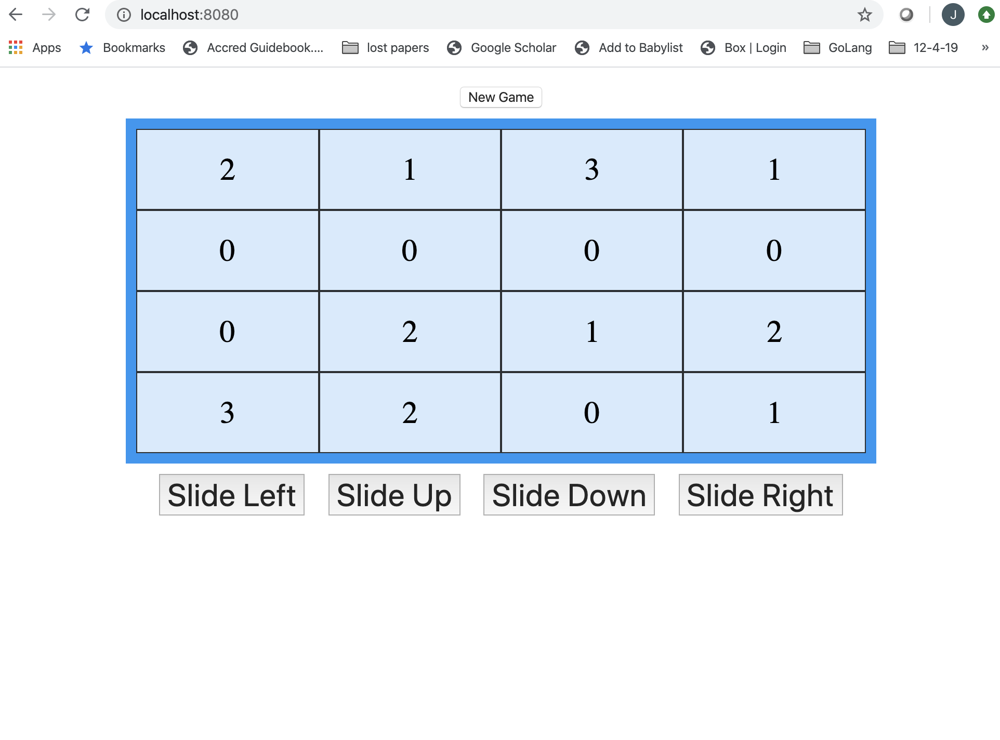

# Kattis 2048 Variation

## Description
This project is a variation of the 2048 problem from [Kattis](https://open.kattis.com/problems/2048).

This variation is puzzle game where a player slide tiles across a 4 x 4 grid with the goal of reducing the number of tiles as much as possible.  The player can slide Up, Down, Right, and Left. When tiles collide that have the same value, they will combine into a sigle tile with the value of the sum of the collided tiles. Zeros are not counted and are treated as blank tiles.

## Installation

## Usage/ How to Run
